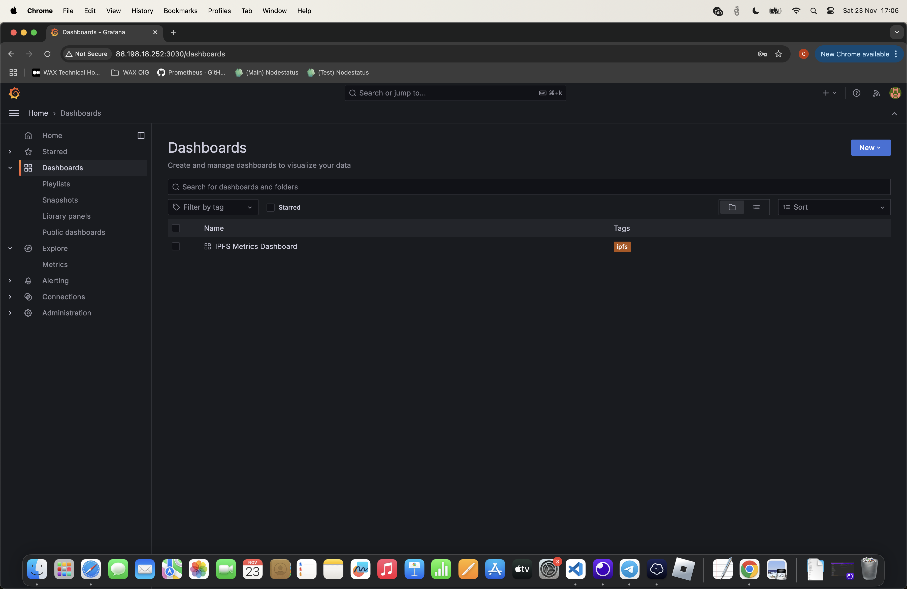
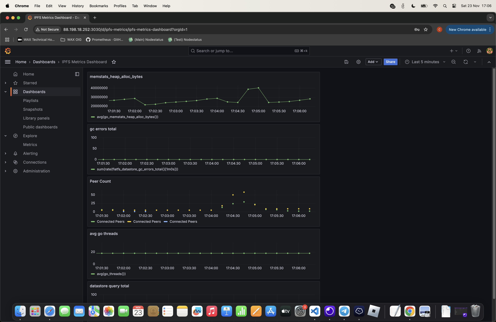
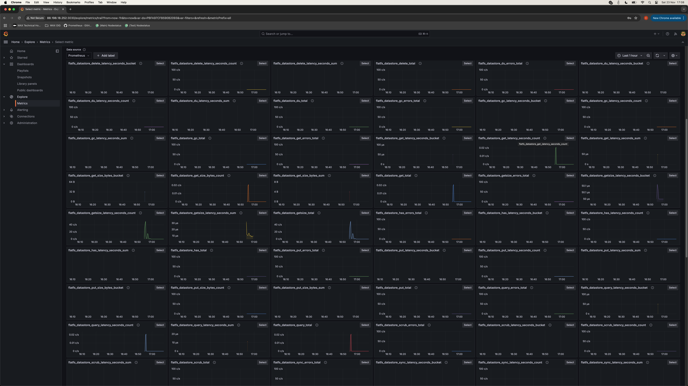

# IPFS Deploy

>IPFS protocol serves for hosting data and transporting it peer-to-peer without relying on centralized servers

- The protocol offers a new way of addressing content consumed over the Internet by making files findable based on the actual contents rather than their location
- Decentralized storage tools are becoming more significant over time seeing the rising interest in non-fungible tokens and a way to store them securely
- Devs benefit from IPFS by hosting dApp data in decentralized repositories instead of a rather costly alternative of keeping it on the blockchain

**Prepare host UDP Buffer Sizes**

```
sysctl -w net.core.rmem_max=7500000
sysctl -w net.core.wmem_max=7500000
```

### Docker Compose
> The following components will be deployed using docker compose

* IPFS
* Prometheus
* Grafana

> IPFS (env)

-  `IPFS_GW_REMOTE_PORT`: Host port for IPFS Gateway, for accessing IPFS content over HTTP.
-  `IPFS_API_REMOTE_PORT`: Host port for IPFS API, for managing the IPFS node programmatically.
-  `IPFS_SWARM_REMOTE_PORT`: Host port for IPFS peering and P2P communication.
-  `IPFS_FRONTEND_REMOTE_PORT`: Host port for exposing service via frontend.

> Grafana (env)

-  `GF_USERNAME`: Initial Grafana Username
-  `GF_PASSWORD`: Initial Grafana Password

Provisioned Dashboard

* Located in grafana/provisioning/dashboards. Example ipfs_dashboard.json available for testing the build

##### Dashboard



##### Some counters defined in ipfs_dashboard.json 



##### All metrics scraped and explorable (i.e. build your own dashboard)




> IPFS custom config settings

- `jq '.Swarm.AddrFilters += ["/ip4/10.0.0.0/ipcidr/8", "/ip4/172.16.0.0/ipcidr/12", "/ip4/192.168.0.0/ipcidr/16"]'`: Prevent the node from connecting to peers in private network ranges
- `jq '.API.HTTPHeaders += {"Access-Control-Allow-Origin": ["*"], "Access-Control-Allow-Methods": ["GET", "POST"]}'`: Allows requests from any origin to access the API (CORS setting) and allow GET and POST methods for API access
- `jq '.Addresses.API = "/ip4/0.0.0.0/tcp/5001"'`: Makes the IPFS API externally accessible by binding it to all network interfaces. Requirement for Prometheus scrape metric data

### Run the IPFS docker solution

```
docker-compose up -d --build
Creating network "ipfs-deploy_ipfs" with driver "bridge"
Creating volume "ipfs-deploy_ipfs" with default driver
Creating volume "ipfs-deploy_grafana-data" with default driver
Building ipfs
[+] Building 0.5s (12/12) FINISHED                                                                                                                                                                                                                                                                                                                                                                            docker:default
 => [internal] load build definition from Dockerfile.ipfs                                                                                                                                                                                                                                                                                                                                                               0.0s
 => => transferring dockerfile: 1.40kB                                                                                                                                                                                                                                                                                                                                                                                  0.0s
 => [internal] load metadata for docker.io/library/ubuntu:22.04                                                                                                                                                                                                                                                                                                                                                         0.4s
 => [internal] load .dockerignore                                                                                                                                                                                                                                                                                                                                                                                       0.0s
 => => transferring context: 2B                                                                                                                                                                                                                                                                                                                                                                                         0.0s
 => [1/7] FROM docker.io/library/ubuntu:22.04@sha256:0e5e4a57c2499249aafc3b40fcd541e9a456aab7296681a3994d631587203f97                                                                                                                                                                                                                                                                                                   0.0s
 => [internal] load build context                                                                                                                                                                                                                                                                                                                                                                                       0.0s
 => => transferring context: 173B                                                                                                                                                                                                                                                                                                                                                                                       0.0s
 => CACHED [2/7] WORKDIR /app                                                                                                                                                                                                                                                                                                                                                                                           0.0s
 => CACHED [3/7] RUN apt-get -y update &&     apt-get -y upgrade &&     apt-get -y install wget curl vim systemctl jq &&     wget https://dist.ipfs.tech/kubo/v0.26.0/kubo_v0.26.0_linux-amd64.tar.gz &&     tar xvf kubo_v0.26.0_linux-amd64.tar.gz &&     mv ./kubo/ipfs /usr/local/bin/ &&     curl -fsSL https://deb.nodesource.com/setup_18.x | bash - &&     apt-get -y install nodejs &&     rm -rf /var/lib/ap  0.0s
 => CACHED [4/7] RUN ipfs version &&     ipfs init &&     jq '.Swarm.AddrFilters += ["/ip4/10.0.0.0/ipcidr/8", "/ip4/172.16.0.0/ipcidr/12", "/ip4/192.168.0.0/ipcidr/16"]' ~/.ipfs/config > /tmp/config &&     mv /tmp/config ~/.ipfs/config &&     jq '.API.HTTPHeaders += {"Access-Control-Allow-Origin": ["*"], "Access-Control-Allow-Methods": ["GET", "POST"]}' ~/.ipfs/config > /tmp/config &&     mv /tmp/confi  0.0s
 => CACHED [5/7] COPY ./files .                                                                                                                                                                                                                                                                                                                                                                                         0.0s
 => CACHED [6/7] RUN chmod +x start.sh                                                                                                                                                                                                                                                                                                                                                                                  0.0s
 => CACHED [7/7] RUN npm install node-fetch@2 express                                                                                                                                                                                                                                                                                                                                                                   0.0s
 => exporting to image                                                                                                                                                                                                                                                                                                                                                                                                  0.0s
 => => exporting layers                                                                                                                                                                                                                                                                                                                                                                                                 0.0s
 => => writing image sha256:d65eb520761fe363114fc460cd5f63059c201b2e9e37768fa458c26dadaaf6c4                                                                                                                                                                                                                                                                                                                            0.0s
 => => naming to docker.io/library/ipfs-deploy_ipfs                                                                                                                                                                                                                                                                                                                                                                     0.0s
Creating grafana    ... done
Creating prometheus ... done
Creating ipfs       ... done
```

### Example Video Resizing Test
> Check the test results in the resizetestfile folder
```
ipfs add screen_recording_2024-11-26.mov
added QmXafmZy8YTmU3B4v7Y2ux7Qg3XWrCZFiYqbPWfPQ8ZFUY screen_recording_2024-11-26.mov
 24.23 MiB / 24.23 MiB [============================================================================================================================================================================================================================================================================================================================================================================================] 100.00%
 
 root@24f9c998fe7b:/app/ipfs/resizetestfile# curl -X POST "http://localhost:3000/resize-video/QmXafmZy8YTmU3B4v7Y2ux7Qg3XWrCZFiYqbPWfPQ8ZFUY?width=640&height=360" --output resized-video.mp4
  % Total    % Received % Xferd  Average Speed   Time    Time     Time  Current
                                 Dload  Upload   Total   Spent    Left  Speed
100  227k  100  227k    0     0  78363      0  0:00:02  0:00:02 --:--:-- 78358

root@24f9c998fe7b:/app/ipfs/resizetestfile# ls -lah resized-video.mp4 
-rw-r--r-- 1 root root 228K Nov 27 19:40 resized-video.mp4
```
*IPFS console output*
```
Fetching video from IPFS: http://localhost:5001/api/v0/cat?arg=QmXafmZy8YTmU3B4v7Y2ux7Qg3XWrCZFiYqbPWfPQ8ZFUY
Video resizing completed!
```

### Example Image Resizing Test
> Check the test results in the resizetestfile folder
```
root@24f9c998fe7b:/app/ipfs/resizetestfile# ipfs add screenshot_2024-11-26.png
added QmRKzqRi9c1HHmPxKXnUTKnyhnCAm6wxrUy6eHyMxwUuoD screenshot_2024-11-26.png
 3.93 MiB / 3.93 MiB [==============================================================================================================================================================================================================================================================================================================================================================================================] 100.00%
 
 root@24f9c998fe7b:/app/ipfs/resizetestfile# curl -X POST "http://localhost:3000/resize/QmRKzqRi9c1HHmPxKXnUTKnyhnCAm6wxrUy6eHyMxwUuoD?width=200&height=200" --output resized-image.png
  % Total    % Received % Xferd  Average Speed   Time    Time     Time  Current
                                 Dload  Upload   Total   Spent    Left  Speed
100   98k  100   98k    0     0   734k      0 --:--:-- --:--:-- --:--:--  737k

root@24f9c998fe7b:/app/ipfs/resizetestfile# ls -lah resized-image.png 
-rw-r--r-- 1 root root 99K Nov 27 19:50 resized-image.png
```
*IPFS console output*
```
Fetching IPFS content for resizing from: http://localhost:5001/api/v0/cat?arg=QmRKzqRi9c1HHmPxKXnUTKnyhnCAm6wxrUy6eHyMxwUuoD
```

| Improvements | Endpoint | Date Implemented | Notes |
|------------------|----------------|------------------|-------|
| Added image resizing endpoint | /resize/CID | 2024-11-27 | Send through width and height as per example in this document |
| Added video resizing endpoint | /resize-video/CID | 2024-11-27 | Send through width and height as per example in this document  |