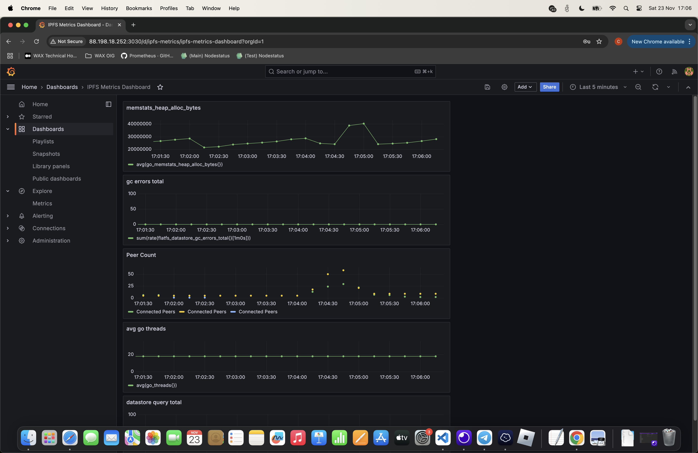
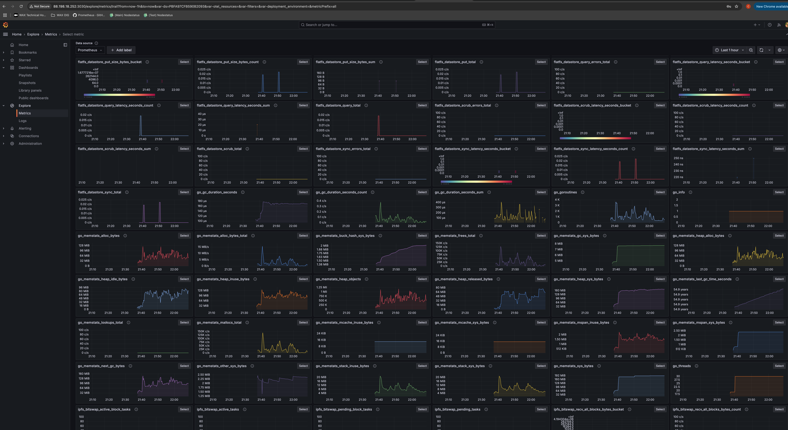

# IPFS Deploy

A containerized IPFS node with additional features for content management and monitoring.

## Key Components (Docker Compose)
* IPFS Node
* Prometheus (Metrics)
* Grafana (Monitoring Dashboard)

## Environment Variables

**IPFS**
* `IPFS_GW_REMOTE_PORT`: IPFS Gateway port (HTTP access to IPFS content)
* `IPFS_API_REMOTE_PORT`: IPFS API port (programmatic node management)
* `IPFS_SWARM_REMOTE_PORT`: IPFS P2P communication port
* `IPFS_FRONTEND_REMOTE_PORT`: Frontend service port

**Grafana**
* `GF_USERNAME`: Initial admin username
* `GF_PASSWORD`: Initial admin password

## Custom IPFS Settings

### Network Security
* **Private Network Filtering**
  ```bash
  /ip4/10.0.0.0/ipcidr/8
  /ip4/172.16.0.0/ipcidr/12
  /ip4/192.168.0.0/ipcidr/16
  ```
  Prevents connections to private IP ranges, enhancing security by limiting peer connections to public networks only.

### API Access
* **CORS Configuration**
  - Origins: Allows requests from any origin (`*`)
  - Methods: Enables GET and POST requests
  - Purpose: Facilitates web application integration and API accessibility

### External Access
* **API Endpoint**: Bound to all interfaces (`0.0.0.0:5001`)
* **Purpose**: 
  - Enables external service connections
  - Allows Prometheus metrics collection
  - Facilitates container-to-container communication

## System Requirements
```bash
# Required UDP buffer sizes
sysctl -w net.core.rmem_max=7500000
sysctl -w net.core.wmem_max=7500000
```

## API Endpoints

### Content Management
* `POST /pin`
  - Pins content to the local node
  - Body: `{ "hash": "IPFS_HASH" }`

* `GET /ipfs/:hash`
  - Retrieves content from IPFS network
  - Params: IPFS hash in URL

### Content Processing
* `POST /resize/:hash`
  - Resizes images stored on IPFS
  - Params: `width` and `height` query parameters
  - Example: `/resize/QmHash?width=200&height=200`

* `POST /resize-video/:hash`
  - Resizes videos stored on IPFS
  - Params: `width` and `height` query parameters
  - Example: `/resize-video/QmHash?width=640&height=360`

### Network Management
* `GET /replication-status/:hash`
  - Shows content replication status
  - Provides peer count, gateway availability, and network details

* `POST /replicate/:hash`
  - Actively manages content replication
  - Optional params: `targetCount`, `maxAttempts`, `checkInterval`
  - Ensures content availability across the network

## Monitoring
Grafana dashboards are available at `http://localhost:3000` with pre-configured IPFS metrics:
* Network performance
* Bandwidth usage
* Peer connections
* Storage metrics

Dashboard configurations are stored in `grafana/provisioning/dashboards/`.

## Quick Start
```bash
docker-compose up -d --build
```

## Recent Improvements

| Feature | Endpoint | Purpose |
|---------|----------|----------|
| Image Resizing | `/resize/:hash` | Dynamically resize IPFS-stored images |
| Video Resizing | `/resize-video/:hash` | Resize video content with quality preservation |
| Replication Management | `/replication-status/:hash` | Monitor content availability |
| Content Distribution | `/replicate/:hash` | Ensure content redundancy |

## Monitoring Dashboard

### Overview


The Grafana dashboard provides real-time monitoring of:
* Network Performance Metrics
* Bandwidth Usage Statistics
* Peer Connection Status
* Storage Utilization

### Key Metrics


Monitor critical IPFS node metrics:
* Content Addition/Retrieval Rates
* Peer Count and Geographic Distribution
* Bandwidth Usage Patterns
* Storage Growth Trends


## Usage Example

### 1. Adding Content to IPFS
```bash
# Add an image to IPFS
ipfs add screenshot_2024-11-26.png
```
> added QmRKzqRi9c1HHmPxKXnUTKnyhnCAm6wxrUy6eHyMxwUuoD screenshot_2024-11-26.png

This command adds your file to IPFS and returns a unique content identifier (CID).

### 2. Pinning Content
```bash
# Pin the content to ensure persistence
curl -X POST -H "Content-Type: application/json" \
     -d '{"hash":"QmRKzqRi9c1HHmPxKXnUTKnyhnCAm6wxrUy6eHyMxwUuoD"}' \
     http://localhost:30000/pin
```
Pinning prevents the content from being garbage collected and ensures availability.

### 3. Check Replication Status
```bash
# Get detailed replication information
curl "http://localhost:30000/replication-status/QmRKzqRi9c1HHmPxKXnUTKnyhnCAm6wxrUy6eHyMxwUuoD"
```
Sample response:
```json
{
  "replicationCount": 336,
  "sufficient": true,
  "overReplicated": true,
  "minRequired": 3,
  "maxDesired": 10,
  "gatewayAvailable": true
}
```
This shows the content is well-replicated across the network and accessible via public gateways.

### 4. Resize Image
```bash
# Resize the image to 200x200 pixels
curl -X POST "http://localhost:30000/resize/QmRKzqRi9c1HHmPxKXnUTKnyhnCAm6wxrUy6eHyMxwUuoD?width=200&height=200" \
     --output resized-image.png
```
Creates a resized version of the image while preserving the original.

### 5. Verify Public Accessibility
```bash
# Check if content is available on public IPFS gateway
curl -I "https://ipfs.io/ipfs/QmRKzqRi9c1HHmPxKXnUTKnyhnCAm6wxrUy6eHyMxwUuoD"
```
A successful response (HTTP 200) confirms the content is accessible through public IPFS gateways.

Key response headers:
- `content-type: image/png`: Confirms the file type
- `cache-control: public, max-age=29030400, immutable`: Indicates content is cacheable
- `x-ipfs-path`: Shows the IPFS path to the content
- `cf-cache-status`: Cloudflare cache status

This workflow demonstrates:
- Content addition and pinning
- Replication monitoring
- Image processing capabilities
- Public accessibility verification